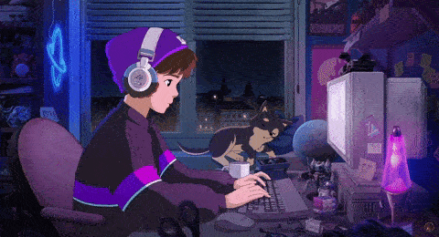

<div align="center">
  
</div>

<div align="center">
  
</div>

<div align="center">
  <a href="https://www.linkedin.com/in/leonardo-oliveira-38aab7321/">
    
  </a>
  <a href="https://lab-oliveira-leo.vercel.app/">
    
  </a>
  <a href="mailto:leonardo.p.oliveira12@aluno.senai.br">
    
  </a>
</div>

<br>

<div align="center">
  

[](https://github.com/PedroLeoo07)
[](https://github.com/PedroLeoo07)

</div>

##  Sobre Mim

<div align="center">
  
</div>

```javascript
const leonardo = {
  nome: "Leonardo Oliveira",
  localização: "🇧🇷 São Paulo, Brasil",
  educação: "📚 SENAI Valinhos - Análise de Sistemas",
  foco: "Desenvolvimento Full-Stack",
  aprendendo: ["TypeScript", "React Native", "Docker"],
  buscando: "Oportunidades Júnior Developer"
};
```

<br clear="left">

### 🚀 **Stack Principal:**
<div align="center">
  
</div>

---

##  Estatísticas GitHub

<div align="center">

<table>
  <tr>
    <td>
      
    </td>
    <td>
      
    </td>
  </tr>
</table>


</div>

---

##  Projetos em Destaque

<div align="center">

<table>
  <tr>
    <td width="50%" align="center">
      <a href="https://github.com/PedroLeoo07/Front-End_RM-api">
        
      </a>
      <br><br>
      <h3>🚀 Rick & Morty API</h3>
      <p><strong>Next.js • API Integration • UI Moderna</strong></p>
    </td>
    <td width="50%" align="center">
      <a href="https://lab-oliveira-leo.vercel.app/">
        
      </a>
      <br><br>
      <h3>💼 Portfólio Pessoal</h3>
      <p><strong>React • Design Responsivo • Vercel</strong></p>
    </td>
  </tr>
</table>

</div>

---

##  Vamos Construir Algo Incrível!

<div align="center">

<p align="center">
  
</p>

### 💬 **Vamos conversar sobre:**
- 🎯 Seu próximo projeto incrível
- 💡 Soluções web inovadoras
- 🚀 Oportunidades de carreira
- ☕ Código, café e tudo mais

</div>

<div align="center">
  
</div>
